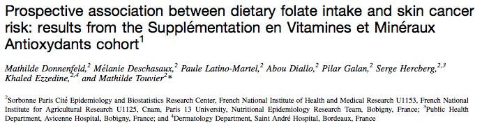
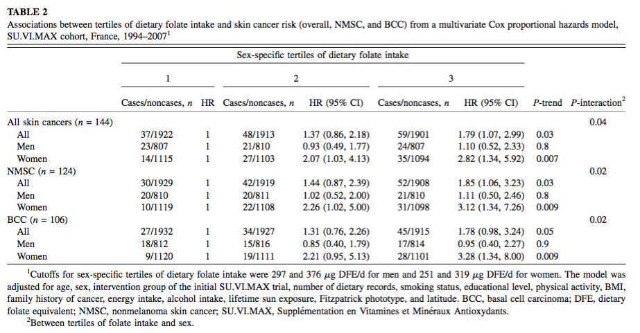
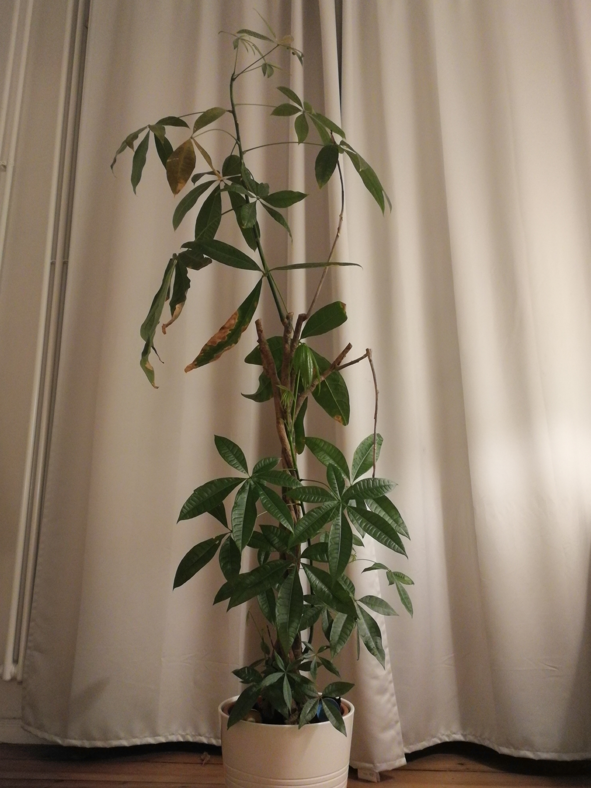

<h1 class="title">Introduction</h1>

<!-- Fonts go here to prevent blank slide -->
<style>
@import url('https://fonts.googleapis.com/css?family=Merriweather|Open+Sans');
</style>
<!-- End fonts -->

```{r setup, include=FALSE}
knitr::opts_chunk$set(
	echo = FALSE
	, message = FALSE
	, warning = FALSE
	# for testing
	# , cache=TRUE
)
```

## A use case

```{r, out.width = "800px"}

```


---

## A use case

```{r, out.width = "800px"}

```

---

## Overview

  What is survival analysis?
  
* Event, TTO, survivor function, survival curves, log-rank test...
  
  What is a Cox model?
  
* Similarities with LM, formula, adjustement...
  
  The assumption of proportional hazards
  
  Modelling
  
  Takeaways
  
  What about real life?

---

<h1 class="title">What is survival analysis?</h1>


```{r}
# uncomment these if you need to install anything
# install.packages("tidyverse")   # for tidy data
# install.packages("revealjs")    # for building presentation
# install.packages("survival")   # for computing survival analysis
# install.packages("survminer")   # for summarizing visualizing survival analysis
# install.packages("ggfortify")   # for plotting survival curves
```


```{r}
library(survival)       # survival analysis
library(survminer)       # survival analysis
#library(ggfortify)      # plot survival curves
library(tidyverse)      # tidy everything
library(glue)           # for string formatting
theme_set(theme_bw())   # nice theme for plots
```
---

### What is survival analysis?

* Underlying idea: all observations will end up 'dying'

* Either we observe this 'death', in which case we measure the time between the beginning of the observation period and the 'death'

* Or we don't, in which case we measure the time between the beginning of the observation period and its end. Those observations are called 'right-censored'.

* Cox model is one way of performing a survival analysis, we'll start with a broader approach then get to the modelling part

---

### What is survival analysis?

* Analyzing the survival time of a set of observations

* For this, we need to define:

    * Survival (a 'death' event, e.g. actual death, medical condition declared, churn of customer...)
    
    * Time to Observation (or TTO, i.e. the time for which we observed the individual before the event occured OR the time after which the individual was censored)

---

### What is survival analysis?

* The 'death' event could be modelized with a logistic regression

* The logistic regression:
    * Uses 'snapshot' data: whether the observation has died at a given point in time 
    * Each independant variable can increase or decrease the probability of being dead at that point.

* Survival analysis:
    * Is interested in analyzing and modelizing the survivor function of the dataset over time
    * Takes in account the survival time observed.

---

### The survivor function

* The survivor (or survival) function gives the probability that an observation will survive beyond a given point in time

* Estimating this function for groups of observations allows to analyse differences in the survival probability across groups

* Let's make things a bit more concrete!

---

### What is survival analysis?

Another use case: please meet Gertrude.

```{r, out.width = "300px"}

```

Gertrude is a *Pachira Aquatica*

---

### Quick look at our dataset

```{r echo=TRUE}
source('generate_dataset.R') 
# Alternatively, you can simply load the csv
# df <- read_csv('plant_survival.csv')
head(df, 10)
```

---

### Quick look at our dataset

```{r echo = TRUE}
# Summary of "died" variable
summary(df$died)
# Summary of "days" variable
summary(df$days)
```

---

### Define a survival object

A survival object is composed of the TTO and the event occuring (Y/N)

```{r echo = TRUE}
# Using the Surv function, from the `survival` package:
df$survival <- Surv(time=df$days, event=df$died)
head(df, 10)
```

---

### Estimating the survivor function

* The combination of information about TTO and event occuring allows us to estimate the survivor function

* The most usual estimate of that function is the Kaplan-Meier estimate

---

### Kaplan-Meier estimate of the survivor function

* A series of time intervals is formed so that at least one tto is contained in the interval

* The start of the interval is the time of this (these) tto(s)

* The count of individuals `at risk` at the beginning of an interval are the individuals that did not died or were censored at that time

---

### Kaplan-Meier estimate of the survivor function

```{r echo = TRUE}
fit <- survfit(survival ~ 1, data = df)
```

```{r}
d1 <- data.frame(time = fit$time,
                  n.at.risk = fit$n.risk,
                  n.event = fit$n.event,
                  n.censor = fit$n.censor
                  )
head(d1, 10)
```

---

### Kaplan-Meier estimate of the survivor function

* The probability of surviving one interval is 

  $$ 1 - \frac{n_{\text{event}}}{n_{\text{at risk}}} $$

* The probability of dying in one interval if survived until then is the hazard

---

### Kaplan-Meier estimate of the survivor function

```{r}
d <- data.frame(time = fit$time,
                  n.at.risk = fit$n.risk,
                  n.event = fit$n.event,
                  n.censor = fit$n.censor,
                  int.hazard = round(fit$n.event/fit$n.risk, 4),
                  int.surv = round(1-(fit$n.event/fit$n.risk), 4)
                  )
head(d, 10)
```

---

### Kaplan-Meier estimate of the survivor function

* The probability of surviving until the end of the n-th interval is the product of all the i-th previous probabilities of surviving, including the n-th

$$
\begin{aligned}
P_{Surv}(\text{Int}K) = &P_{Surv}(\text{Int}_1)  \\ &\times P_{Surv}(\text{Int}_2) | (\text{Surv}(\text{Int}_1))  \\ &\times \dotsc  \\ &\times P_{Surv}(\text{Int}_K) | (\text{Surv}(\text{Int}_{K-1}))
\end{aligned}
$$

---

### Kaplan-Meier estimate of the survivor function

```{r out.width = "600px"}
d <- data.frame(time = fit$time,
                  n.at.risk = fit$n.risk,
                  n.event = fit$n.event,
                  n.censor = fit$n.censor,
                  int.hazard = round(fit$n.event/fit$n.risk, 4),
                  int.surv = round(1-(fit$n.event/fit$n.risk), 4),
                  surv = round(fit$surv, 4),
                  upper = round(fit$upper, 4),
                  lower = round(fit$lower, 4)
                  )
head(d, 10)
#res.sum <- surv_summary(fit) 
#This built-in function from the survminer package gives the same as above, without the int.risk and int.surv columns
#head(res.sum, 10)
```

---

### Plot the survival curve

```{r}
#ggsurvplot, from the survminer package
ggsurvplot(fit,
          pval = TRUE, conf.int = TRUE,
          risk.table = TRUE, # Add risk table
          risk.table.col = "strata", # Change risk table color by groups
          linetype = "strata", # Change line type by groups
          surv.median.line = "hv" # Specify median survival
)
```

--- 

### Plot the survival curveS

```{r out.width = "800px"}   
fit_proportional <- survfit(survival ~ species, data = df)
ggsurvplot(fit_proportional,
          pval = TRUE, pval.method = TRUE, conf.int = TRUE,
          risk.table = "percentage", # Add risk table
          risk.table.col = "strata", # Change risk table color by groups
          risk.table.height = 0.34,
          linetype = "strata", # Change line type by groups
          surv.median.line = "hv" # Specify median survival
)
``` 

---

### Plot the survival curveS

* The more uplifted the curve, the higher the survival

* We can compare the median survival for each strata (strata = group of observations that share the same factor level)

* The p-value displayed is the log-rank test p-value

---

### The log-rank test

* Tests whether there is a difference between survival curves, similarly to a Chi-square test

* It compares the count of observed events against the count of expected events over time

* Look at the p-value for the overall association

* Look at the 3rd column for the association by level. The more distant from 1, the more unexpected this count of events is

---

### The log-rank test

```{r echo=TRUE}
#From the `survival` package
survdiff(survival ~ species,data=df)
```

---

<h1 class="title">What is a Cox Model?</h1>

---

### What is a Cox model?

* Linear regression with the log of the hazard function as dependant variable

* Estimates coefficients accounting for other independant variables

$$ h_i(t) = h_0(t) \cdot \text{exp}(\beta_1 x_{i1} + \dotsc + \beta_k x_{ik}) $$

* Only the baseline hazard function varies with time

---

<h1 class="title">The assumption of proportional hazards</h1>

---

### The assumption of proportional hazards

```{r}
#survfit is from `survival`
#ggsurvplot is from `survminer`
fit_unproportional <- survfit(survival ~ name, data = df)
ggsurvplot(fit_unproportional,
          pval = TRUE, pval.method = TRUE, conf.int = TRUE,
          risk.table = TRUE, # Add risk table
          risk.table.col = "strata", # Change risk table color by groups
          linetype = "strata", # Change line type by groups
          surv.median.line = "hv" # Specify median survival
)
```

---

### The assumption of proportional hazards

* The coefficient of the association between a variable and the hazard function should not vary over time

* Visually, curves should be proportional and can not cross

* ! Still needs proper testing !

* We can either stratify on the variable that does not respect the assumption

* Or simply exclude it from the model

---

<h1 class="title">Modelling</h1>

---

### Modelling

In code:

```{r echo=TRUE}
# Remember, we defined df$survival <- Surv(time=df$days, event=df$died)
model_full <- coxph(survival ~ name
      + species
, data = df)
```

---  

### Testing assumption of proportional hazards

```{r echo=TRUE}
cox.zph(model_full)
```

---

### Modelling: simplification of the model

We chose to take the `name` variable out, as it does not respect the assumption of PH.

```{r echo=TRUE}
model_short <- coxph(survival ~ species
, data = df)
cox.zph(model_short)
```

---

### Modelling: Model output

```{r}
summary(model_short)
```

---

### Modelling: Model output

* We look at exp(coef), which is the Hazard Ratio *(HR)* for that level of the factor compared to the reference level

* The p-value is the one of the test of a HR different from 1

* If the p-value is significant and HR > 1, the level of the factor is deleterious

* If the p-value is significant and HR < 1, the level of the factor is protective

* A cactus has, at any point in time, 35% chances less of dying than a basil (not too surprising)

---

### Modelling: Adjustement

```{r}
summary(model_full)
```

---

### Modelling: Adjustement

**Those coefficients are not interpretable (the model does not respect the PH assumption)... but if they were:**

* A cactus has, at any point in time, 36.5% chances less of dying than a basil, *other variables held constant*

* This implies that there is no interaction between `species` and `name` (i.e. the HR for cactus compared to basil is the same whether the plant has a name or not)

* We could also add an interaction term in the form of `name*species` if we suspected there was an interaction between those variables

---

### Takeaways

* Survival analysis is a powerful tool for analyzing the association of variables with a probability of survival

* Cox model allows to control for adjustment variables and gives valuable Hazard Ratios as output

* Your data has to respect the assumption of proportional hazards, otherwise it invalidates the entire model

* This means that the coefficient of the association between a variable and the hazard function should not vary over time

---

### What about real life?

* The proportional hazards assumption is a strong one, and hard to meet

* It is NOT because we are taking time in account that we can talk about cause. The design of the study still has to be prospective.

* Congrats to Gertrude (1.5 years and counting!), living proof that you'll always find outliers

---


## Further reading & References
* [Donnenfeld et al., *Prospective association between dietary folate intake and skin cancer risk: Results from the Supplémentation en Vitamines et Minéraux Antioxydants cohort*](https://www.researchgate.net/publication/279990457_Prospective_association_between_dietary_folate_intake_and_skin_cancer_risk_Results_from_the_Supplementation_en_Vitamines_et_Mineraux_Antioxydants_cohort)
* [Kosinski, *Survival plots have never been so informative*](https://cran.r-project.org/web/packages/survminer/vignettes/Informative_Survival_Plots.html)
* [LaMorte, *Comparing survival curves: The log-rank test*](http://sphweb.bumc.bu.edu/otlt/MPH-Modules/BS/BS704_Survival/BS704_Survival5.html)
* [Walters, *What is a Cox model?*](http://www.bandolier.org.uk/painres/download/whatis/COX_MODEL.pdf)
* [Stevenson, *An introduction to survival analysis*](http://s3.amazonaws.com/zanran_storage/epicentre.massey.ac.nz/ContentPages/111789122.pdf)

---

<h1 class="title">Thanks!</h1>
